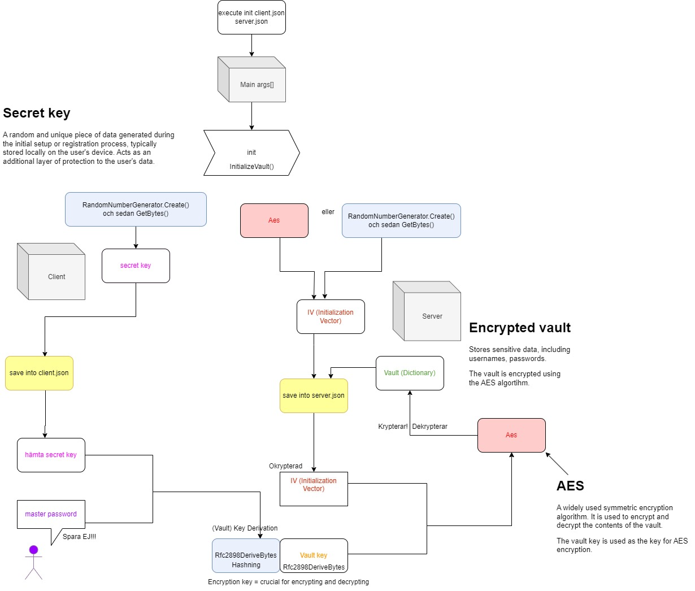

# Password Manager

## Overview
This is a console application done in C# collaboratively in a team of three students at Uppsala University. The main function is to generate, manage and store passwords using Advanced Encryption Standard (AES) ecryption (symmetrical encryption). The application works with a client and a server that have separate responsibilities, the client stores a secret key and the server stores an encrypted vault and a Initialization Vector (IV). 

## How the application works
The application must be executed from the terminal, sending commands as arguments to the Main-function in the Program class. There are a total of six different commands that can be used to run the application, these are:

1. Init: you will enter a master password to initialize a client and a server, and also create and encrypt the vault to store in server together with the IV. In the client, a unencrypted secret key will be random generated and stored.
How to run: 
- PasswordManager.exe init client.json server.json

2. Create: you will enter both master password and the secret key, to create another client-file with the same secret key. This enables you to access the vault from another device.
How to run: 
- PasswordManager.exe create client2.json server.json

3. Get: lists all usernames that exists in the vault, and if you send in a specific username as an argument, it will list the password for that username.
How to run: 
- PasswordManager.exe get client.json server.json example@mail.com

4. Set: sets a new password for a specific username in the vault, if the username does not already exist it will be added, and if it do exist already it will be overwritten. You can choose to add an own password or to generate a new random password. If you want to random generate a password you send in "-g" or "--generate" as an argument.
How to run: 
- PasswordManager.exe set client.json server.json example@mail.com
- PasswordManager.exe set client.json server.json username@mail.com -g

5. Delete: deletes an account from the vault.
How to run:
- PasswordManager.exe delete client.json server.json username@mail.com

6. Secret: shows the secret key in plain text.
How to run:
- PasswordManager.exe secret client.json

## Process and data diagram

## Requirements specification
* Console application written in C#
* No external libraries
* Exceptions must be handled.
* Needs to pass all integration tests (GIST: https://gist.github.com/naxxxe/607494b6b59a4dfe062210d0f4310acb)
